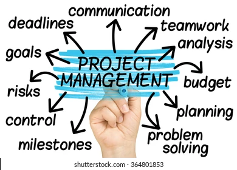

# **pm-notes**

## **44-618-D02 PM4**

### **Learning Objectives**
* Define the systems view of project management and how it applies to information technology (IT) projects.
* Summarize organizations, including the four frames, organizational structures, and organizational culture.
* Explain why stakeholder management and top management commitment are critical for a project’s success.
* Distinguish between project and product life cycle.

### **Advice for Young Professionals**
1. Make it a priority. Don’t just focus on the technology, no matter how exciting it seems to you. Even if you take just a few minutes each day learning about other aspects of the organization, that’s a start. 
2. Tell your boss or other people you work with that you want to understand how the entire organization works. Ask important questions like how the company makes money, who key customers are, what the priorities are for the year, what meetings you can attend or documents you can read to gain more knowledge, etc. 
3. Network, network, network! Find out which people inside or outside of your organization can help you in developing a systems approach. You might be surprised how quickly you can move up in your career once you understand the big picture.

 [More info](https://en.wikipedia.org/wiki/Project_management)

 

